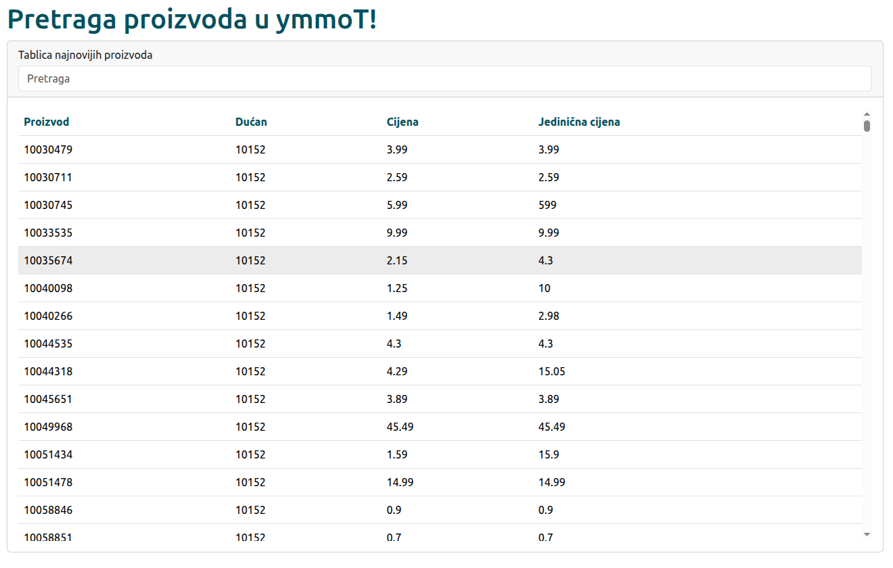

# Primjer pretrage proizvoda

[](./screenshots/preview.png)

Primjer playground Angular aplikacije koja se povezuje sa Supabase backendom za dohvat cijena proizvoda.

Proizvodi dobiveni inicijativom za uvid u cijene dućana.

## Development server

Za pokrenuti lokalno development server, u terminalu pozvati Angular CLI komandu:

```bash
ng serve
```

Locirati se u pregledniku na `http://localhost:4200/`.

## Preduvjeti

- Angular CLI: 20+
- NodeJS: 22+

Napraviti svoju Supabase bazu i staviti ključeve u `public/config.json` datoteku:

```json
{
  "supabase": {
    "url": "url-vlastitog-projekta",
    "key": "vlastiti-ključ"
  }
}
```

## Unit testovi

Pokrenuti u terminalu s naredbom:
```shell
npm test
```

Ako koristite bun onda ovako:
```shell
bun test
```

## Autor

- [Matija Čvrk](https://hr.linkedin.com/in/matija-%C4%8Dvrk-1388b3101/)

## License

- [GNU AGPL Version 3](./LICENSE)
